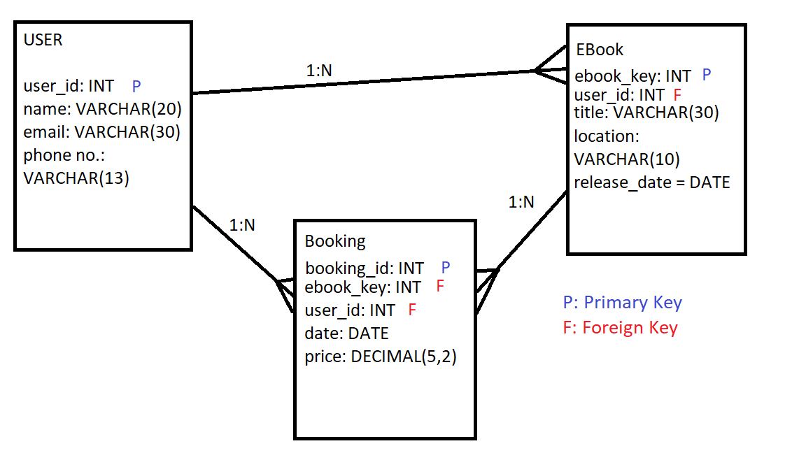

# EBooks Task

[SQL Exercise Requirements](https://github.com/Filipe-p/sql)

## ERD



### Questions

_What is the relationship between the tables?_
- USER to EBook: Assuming one (primary) author per EBook, one user can write multiple EBooks, therefore it is a 1:N relationship. If we allow for multiple users to contribute to one EBook then it would be a N:N relationship.
- USER to Booking: One user can make bookings for multiple Ebooks, therefore it is a 1:N relationship.
- EBook to Booking: An instance of an EBook can be checked out multiple times, therefore it would be a 1:N relationship.

_Can users rent out books?_  
A user can rent out multiple books through multiple bookings.

_How many 1:N relationships are there?_  
There are 3 1:N relationships.

_Do we have or do we need a N:N relationship?_  
If we allow for multiple users to contribute to one book then User-to-Ebook would be a N:N relationship. Also if we allow for multiple EBooks to be checked out for one booking then that would also be a N:N relationship.


## Setting Up the DB

```
-- create database
CREATE DATABASE booksareus_db;

USE booksareus_db;

-- create tables
CREATE TABLE users(
	user_id INT NOT NULL IDENTITY(1,1) PRIMARY KEY,
	name VARCHAR(20) NOT NULL,
	email VARCHAR(30) NOT NULL,
	phone_number VARCHAR(13) NOT NULL
);

CREATE TABLE ebooks(
	ebook_id INT NOT NULL IDENTITY(1,1) PRIMARY KEY,
	user_id INT FOREIGN KEY REFERENCES users(user_id),
	title VARCHAR(30) NOT NULL,
	ebook_location VARCHAR(10) NOT NULL,
	release_date DATE NOT NULL
);

CREATE TABLE bookings(
	booking_id INT NOT NULL IDENTITY(1,1) PRIMARY KEY,
	user_id INT FOREIGN KEY REFERENCES users(user_id),
	ebook_id INT FOREIGN KEY REFERENCES ebooks(ebook_id),
	booking_date DATE NOT NULL,
	price DECIMAL(5,2) NOT NULL
);
```

