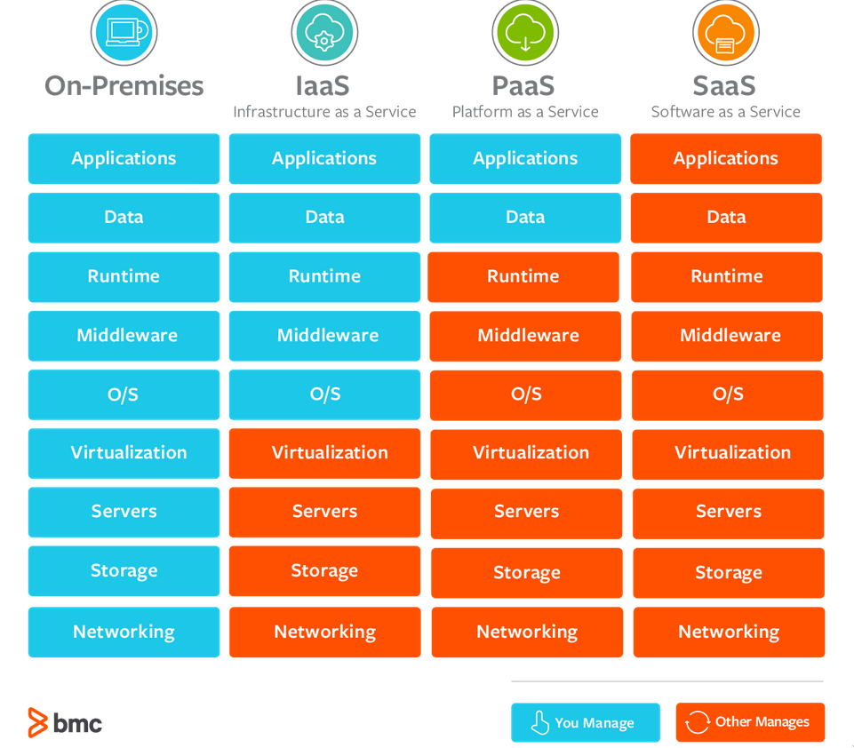

# DevOps

## Why DevOps - Benefits to the Business

Technical benefits
- Continuous software delivery
- Less complexity to manage
- Faster resolution of problems

Cultural benefits
- Happier, more productive teams
- Higher employee engagement
- Greater professional development opportunities

Business benefits
- Faster delivery of features
- More stable operating environments
- Improved communication and collaboration
- More time to innovate (rather than fixing/maintaining)

In a non-DevOps environment, there can be tension between the two teams:
- Development team is measured on updates they deliver
- Operations team measured on health of system

Whereas in a DevOps environment, the entire team is responsible for delivering both new features and stability. Furthermore, the problems that arise tend to be less complex in nature because changes are made in smaller increments. The various tools used in a DevOps environment also allows the team to find problems earlier in the process.

### The Tools of DevOps

There are numerous tools that a DevOps team would use. These tools enable the team to have a shared codebase, allow for continuous integration and delivery, automated deployment, test-driven techniques, and many more.

**Git and GitHub**
- Distributed **S**ource **C**ode **M**anagement tool
- Allows to roll code back to a previous version when problems occur
- Allows for experimentation, branching to create new features and merging only when they're ready

**Jenkins**
- Open source CI/CD server that allows automation of different stages of delivery pipeline
- Popular due to its plugin ecosystem, allowing for customization
- Can iterate and deploy new code as quickly as possible, and report on the success of each step

**Docker**
- Containerization tool, makes distributed development possible as well as automating the deployment of apps
- Isolates applications into separate containers, so they become portable and secure
- Allows for packaging dependencies within the app's container and ship the whole item as an independent unit

**Puppet**
- Cross-platform configuration management platform
- Manage **I**nfrastructure **A**s **C**ode, automates infrastructure management allowing to deliver software faster and more securely.

**Ansible**
- Configuration management tool, following IAC approach
- Uses simple YAML syntax
- No daemons or agents run in the background, making Ansible a secure and lightweight solution

## Cloud Computing

Cloud computing is the on-demand availability of computer system resources, especially data storage (cloud storage) and computing power, without direct active management by the user.

**SAAS**
- Software as a Service
- Software licensing and delivery model in which software is licensed on a subscription basis and is centrally hosted
- Often accessed using a 'thin client' (e.g. web browser) 
- Examples include office software, messaging software, CAD software, and many more.

**PAAS**
- Platform as a Service
- Provides a platform to allow customers to develop, run, and manage applications
- Without the complexity of building and maintaining the infrastructure typically associated with developing and launching an app.

**IAAS**
- Infrastructure as a Service 
- Instant computing infrastructure, provisioned, and managed over the internet.

**In computer networking, localhost is a host name that refers to the local computer that a program is running on.**

**On-premises software (on-prem) is installed and runs on computers on the premises of the person or organization using the software, rather than at a remote facility such as a server farm or cloud.**

**Public cloud is a type of computing in which a service provider makes resources available to the public via the internet.**

**Hybrid cloud refers to a mixed computing, storage, and services environment made up of on-premises infrastructure, private cloud services, and a public cloud (such as AWS or Azure) with orchestration among the various platforms.**
