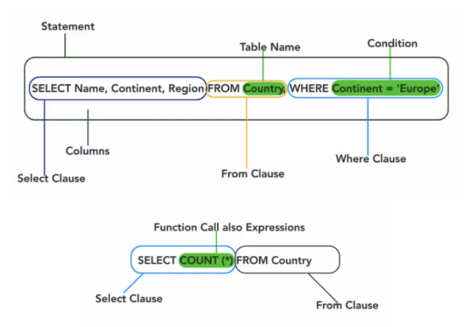

# 27/10/2020

### Normal Form

Best practices for designing DBs

**1st Normal Form**: A DB is in 1NF when the following conditions are satisfied:
- Make everything atomic: Data must be presented as small as it can be
- There should be no repeating groups

**2nd Normal Form**
- It is in 1NF
- All non-key attributes are fully functional dependent on the primary key

**3rd Normal Form**
- It is in 2NF
- There is no transitive functional dependency (i.e. a TFD is when a non-key column is functionally dependent on another non-key column, which is functionally dependent on the primary key)

### Using SQL as a DevOps Engineer

- Getting data for testing
- Saving data, generated during testing activity
- Data verifications in DBs: find data, ensure data integrity, manipulate test data for specific tests
- Testing DBs
- As a developer will need to make data persistent (exists and stays on DB)

As a PMO/BA
- Systems teams will use DB in development
- To analyse data, you need to be able to retrieve it
- You can build small DBs to support prototyping, analysis, data management, and reporting
- Allow to help during the test phase
- Helps to understand data flow, data warehouses and analytical products

## Querying an SQL DB

**SQL SELECT Statemnt - Logical (Syntax) Sequence**
- SELECT
- DISTINCT/COUNT
- FROM
- WHERE
- GROUP BY
- HAVING
- ORDER BY

Beware of correct formatting for WHERE clauses, e.g. VARCHAR requires ''  

**WildCards**
Wildcards can be used as a substitute for any other characters in a string when using the LIKE operator
- %: A substitute for zero or more characters
- _: A substitute for a single character
- -: Represents a range of characters, i.e. c[a-b]t will find cat or cbt 
- [charlist]: Sets ranges of characters to match, i.e. LIKE [ABC]% will bring back anything starting with any of those letters
- [^charlist]: Sets and ranges of characters that don't match, i.e. LIKE [^ABC]% will bring back anything that does not start with those letters

**IN**  
``WHERE item IN ('loc1', 'loc2')`` will find items are in location 1 or 2

**BETWEEN**  
``WHERE number BETWEEN 0 AND 10`` will find number between 0 and 10

**AS**  
Gives option to rename output column name

**Concatenate**  
Use + to concatenate outputs
``City + ', ' + Country AS 'City'`` will output _London, UK_

