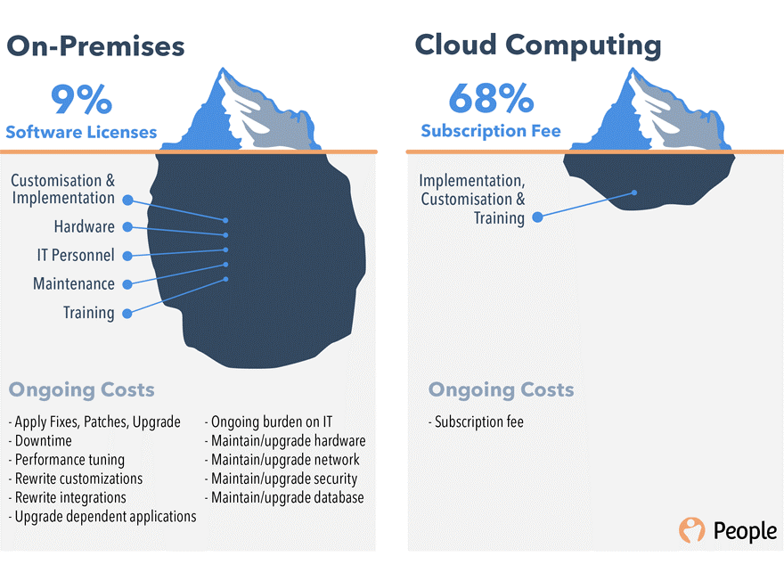
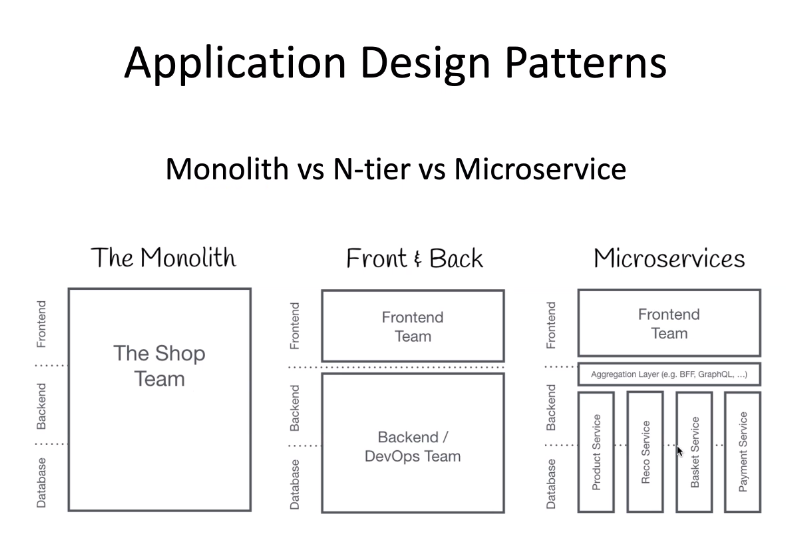

# DevOps Intro

## History of DevOps

### Dev, Ops, and Infrastructure

Software/Web Development and Operations back in the day:
	- Updates took longer to roll out
	- Physical and hard obstacles
	- Bugs took longer to fix
	- Feedback-loop took longer
	- Slow
	- Process Change Mechanism: Clauses where you pay extra if you want to change the specifications during the development period
	- Clients only get to see the software at the end, slow feedback loop

In the 2000s onwards, Agile methodology started to develop:
	- Working software over documentation
	- Customer collaboration
	- Individual interactions over the process
	- Responding to change
	- Figure out what can be delivered in 1 month, what is most important, discuss with product owner/clients, and change accordingly
	- Product owner shown progress/release at end of each sprint, faster feedback loop
	- Enables teams to deliver value faster and collect feedback earlier

Dev cycles may take 1 month, but in reality can take 5 months to release due to the extra time taken for quality assurance (testing) and deployment
	- Project manager/Dev team are judged on how fast they can deliver features, but this can be at the expense of the testing/operations team as they have to deal with the (potentially very complex) bugs, slowing down time to release

Some companies start to emerge as performing better and delivering faster, as they started to incorporate DevOps

### DevOps
- Uses
	- Automated Testing: Continuous Integration
	- Automated Deployment: Continuous Deployment
- CI/CD has taken processes that could've taken months and reduced it down to a few minutes (once set up properly)
- This enables stable builds with less bugs, allows to deliver releases even faster

**Infrastructure Revolution**
- On prem vs Cloud Computing
- Servers and Data centres
- Cloud and IaaS, PaaS, SaaS

**Application Design Patterns**

**4 Pillars of DevOps**
- Ease of use
- Flexibility
- Robustness
- Cost

